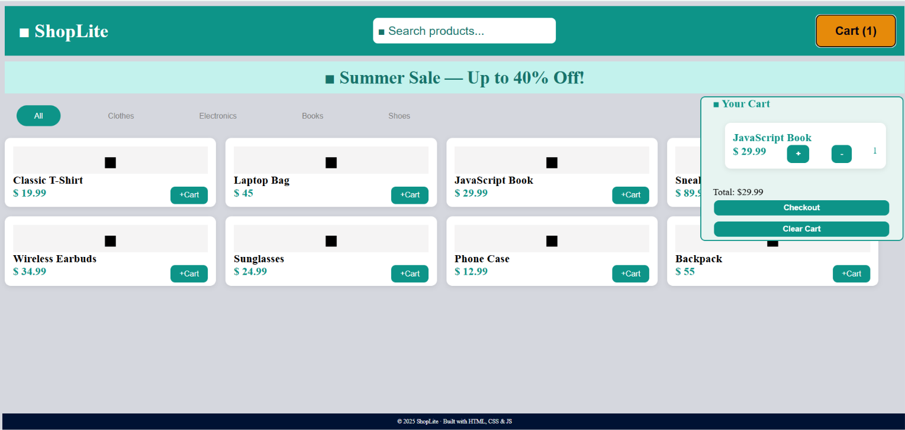

# 🛒 ShopLite — One Page E-Commerce Store

A simple one-page e-commerce website built using **HTML, CSS, and JavaScript**.
The project includes dynamic product rendering, category filtering, live search, shopping cart functionality, and localStorage persistence.

This project was developed as a **team project of 2 members** using GitHub branches and collaboration workflow.

---

## 📌 Project Overview

**ShopLite** is a front-end online store where users can:

* Browse products
* Search products by name
* Filter products by category
* Add products to a shopping cart
* Increase product quantities
* Remove products from the cart
* Save the cart using localStorage
* Checkout and clear the cart

No backend or database is used. Product data is stored in a static JavaScript array.

---

## 🚀 Technologies Used

* HTML5
* CSS3
* JavaScript (ES6)
* localStorage
* Git & GitHub

---

## 📂 Project Structure

```
shop-lite/
│
├── index.html      # Main HTML structure
├── style.css       # Website styling
├── script.js       # Product and cart logic
└── README.md       # Project documentation
```

---

## ✨ Features

### 🏠 HTML Structure

The website contains:

* Navigation bar

  * ShopLite logo
  * Search input
  * Cart button with item counter

* Promotional hero banner

* Category filter buttons:

  * All
  * Clothes
  * Electronics
  * Books
  * Shoes

* Dynamic product grid

* Shopping cart panel:

  * Cart items
  * Quantity display
  * Total price
  * Checkout button
  * Clear cart button

* Footer section

---

## 🎨 CSS Features

The design includes:

* Flexbox layout
* Responsive product grid
* Product cards with hover effects
* Active filter button styling
* CSS variables for theme colors
* Mobile responsive layout

Responsive behavior:

* Desktop → 4 product columns
* Mobile → 2 product columns

---

## ⚙️ JavaScript Features

### Product Management

Products are stored in a static array:

Each product contains:

* ID
* Name
* Price
* Category
* Emoji

Example:

```javascript
{
 id: 1,
 name: "Classic T-Shirt",
 price: 19.99,
 category: "Clothes",
 emoji: "👕"
}
```

---

### Shopping Cart

Implemented features:

✅ Add product to cart
✅ Increase quantity if product already exists
✅ Remove products
✅ Calculate total price
✅ Update cart count automatically
✅ Clear cart
✅ Checkout message

---

### Search & Filter

Users can:

* Search products instantly by name
* Filter by category
* Use search and category filtering together

---

### Local Storage

The cart is saved using:

```javascript
localStorage
```

This allows the cart to stay available even after refreshing the page.

---

## 👥 Team Collaboration

This project was completed by:

| Member   | Responsibilities                            |
| -------- | ------------------------------------------- |
| Zaynab Hwayji | HTML structure, CSS styling, JavaScript functionalityand GitHub collaboration      |
| Nour Asfour   | HTML structure, CSS styling, JavaScript functionalityand GitHub collaboration        |

Both members worked using separate Git branches and merged their work into the main branch.

---

## 🌿 Git Workflow Used

Branches:

```
main
│
├── Navbar/css
│
└── FilterBar-Footer
```

Workflow:

1. Created separate branches
2. Worked independently
3. Committed changes 
4. Pushed branches to GitHub
5. Merged branches into main

---

## ▶️ How to Run the Project

1. Clone the repository:

```bash
git clone YOUR_REPOSITORY_LINK
```

2. Open the project folder.

3. Open:

```
index.html
```

in your browser.

No installation or server is required.

---

## ✅ Project Requirements Completed

✔ One-page e-commerce website
✔ Dynamic product rendering
✔ Product filtering
✔ Live search
✔ Shopping cart system
✔ localStorage persistence
✔ Responsive design
✔ GitHub collaboration with branches
✔ Clean HTML/CSS/JS structure

---

## 📸 Preview

ShopLite includes:

* Product cards
* Shopping cart sidebar
* Search and filter system
* Responsive layout


---

## 📄 License

This project was created for educational purposes.

© 2025 ShopLite — Built with HTML, CSS & JavaScript
